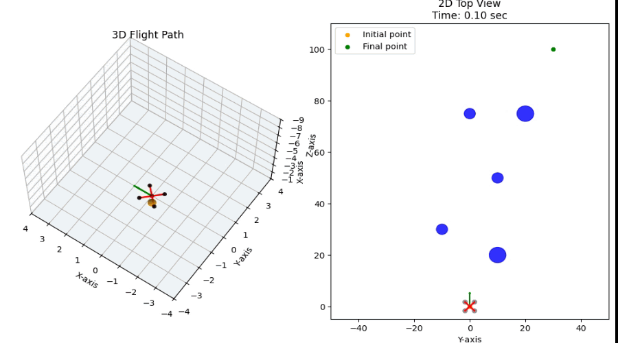

# Quadrotor-Simulation-Python

This repository contains Python script for simulating a quadrotor UAV. It is designed for researchers and developers working on control systems and path planning algorithms. The simulation integrates the quadrotor dynamics using the Runge-Kutta numerical method.

You can customize the quadrotor’s behavior and simulation settings by modifying the parameters in the `quadrotor_parameters.py` script.

Key features include:

- Compatible with [Gymnasium  ](https://gymnasium.farama.org/) environments for reinforcement learning (RL) algorithms.
- Modular design for easy integration with different control and planning algorithms.
- Functions to generate 2D and 3D visualizations of the quadrotor flight and surrounding obstacles.

